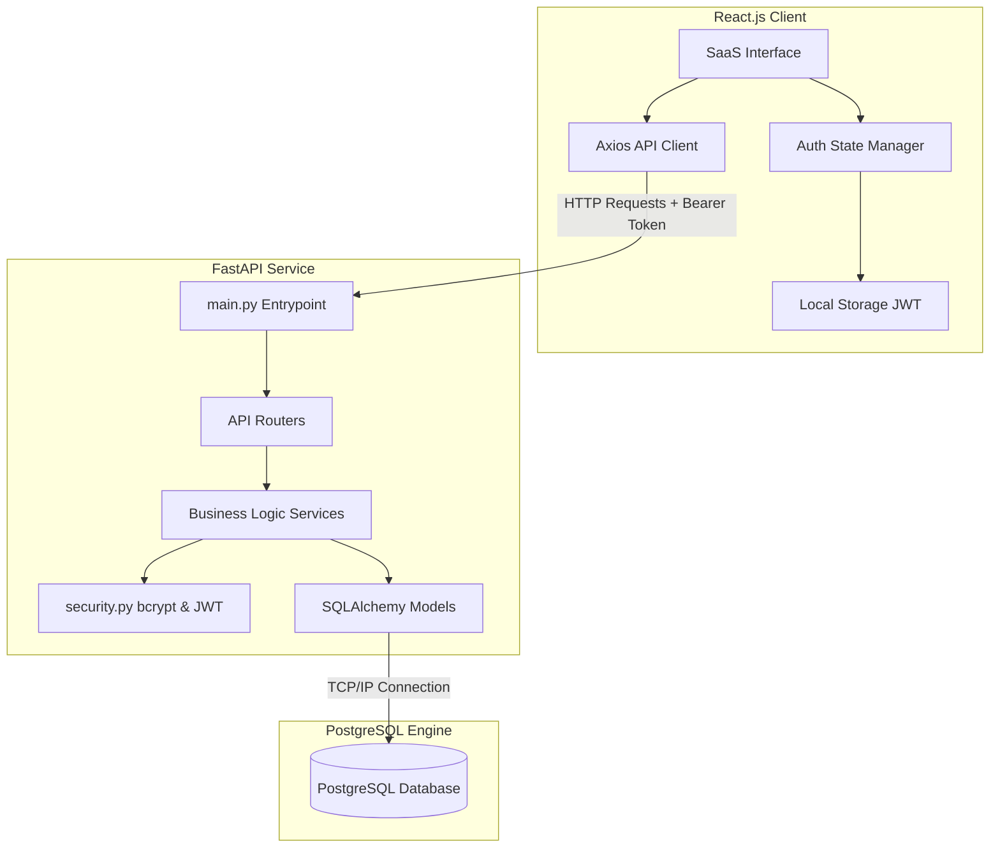
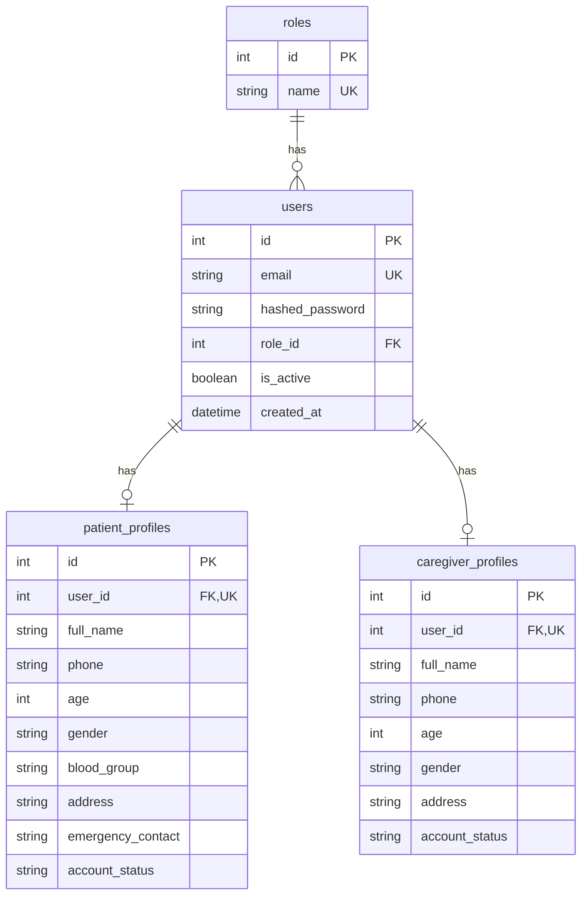

# PillSync – Intelligent Medicine Reminder and Medication Tracking Platform

PillSync is a healthcare management system designed to reduce medication non-adherence by connecting patients, caregivers, and administration. This repository contains the complete implementation for **Milestone 1** of the PillSync platform.

---

## Project Overview

Milestone 1 sets up the foundational infrastructure of PillSync:
- **Foundational Architecture**: Dual-layer decoupled setup with React and FastAPI.
- **Relational Database Design**: Robust PostgreSQL schema with strict foreign key constraints.
- **Security & Authorization**: JWT token-based authentication and role-based access control (RBAC).
- **Profile Customization**: Context-aware profile attributes matching Patient and Caregiver roles with strong validator rules.

---

## Technologies Used

### Frontend
- **React.js**: Modular reusable component architecture.
- **React Router**: Client-side route guarding and protection.
- **Axios**: HTTP communication with the backend.
- **Vanilla CSS**: Clean, SaaS-style visual design.

### Backend
- **Python FastAPI**: Modern, fast (high-performance), web framework for building APIs.
- **SQLAlchemy**: Relational Database ORM.
- **Psycopg2**: PostgreSQL database adapter.
- **python-jose & passlib [bcrypt]**: Password hashing and secure JWT signing.

### Database
- **PostgreSQL**: Production-grade relational database management system.

---

## Project Architecture Diagram



---

## Database ER Diagram



---

## Database Schema (PostgreSQL)

See full definition in `database/schema.sql`.

### 1. `roles` Table
Stores user classifications. Seeded values: `admin` (id: 1), `patient` (id: 2), `caregiver` (id: 3).

### 2. `users` Table
Handles credentials and active status.
- Linked to `roles` via `role_id`.

### 3. `patient_profiles` Table
Stores details for patient accounts.
- Linked to `users` via `user_id`.

### 4. `caregiver_profiles` Table
Stores details for caregiver accounts.
- Linked to `users` via `user_id`.

---

## API Documentation

### Base URL: `http://localhost:8000/api`

### 1. Authentication Endpoints

#### Patient Registration
- **Endpoint**: `/auth/register/patient`
- **Method**: `POST`
- **Headers**: `Content-Type: application/json`
- **Request Body**:
  ```json
  {
    "email": "patient@domain.com",
    "password": "Password123",
    "full_name": "John Doe"
  }
  ```
- **Response (201 Created)**:
  ```json
  {
    "message": "Registration successful",
    "user_id": 2
  }
  ```
- **Response (400 Bad Request)**: `{"detail": "Email is already registered"}`

#### Caregiver Registration
- **Endpoint**: `/auth/register/caregiver`
- **Method**: `POST`
- **Headers**: `Content-Type: application/json`
- **Request Body**:
  ```json
  {
    "email": "caregiver@domain.com",
    "password": "Password123",
    "full_name": "Jane Smith"
  }
  ```
- **Response (201 Created)**:
  ```json
  {
    "message": "Registration successful",
    "user_id": 3
  }
  ```

#### Secure Login
- **Endpoint**: `/auth/login`
- **Method**: `POST`
- **Headers**: `Content-Type: application/json`
- **Request Body**:
  ```json
  {
    "email": "patient@domain.com",
    "password": "Password123"
  }
  ```
- **Response (200 OK)**:
  ```json
  {
    "access_token": "eyJhbGciOiJIUzI1NiIsIn...",
    "token_type": "bearer",
    "role": "patient",
    "email": "patient@domain.com"
  }
  ```
- **Response (401 Unauthorized)**: `{"detail": "Invalid email or password"}`

#### Current User Details
- **Endpoint**: `/auth/me`
- **Method**: `GET`
- **Headers**: `Authorization: Bearer <token>`
- **Response (200 OK)**:
  ```json
  {
    "id": 2,
    "email": "patient@domain.com",
    "role": "patient",
    "is_active": true,
    "created_at": "2026-07-05T19:30:00Z",
    "profile": {
      "id": 1,
      "full_name": "John Doe",
      "phone": "+1234567890",
      "age": 30,
      "gender": "male",
      "blood_group": "O+",
      "address": "123 Main St",
      "emergency_contact": "Jane Doe - 9876543210",
      "account_status": "Active"
    }
  }
  ```

---

### 2. Profile Management Endpoints

#### View Profile
- **Endpoint**: `/users/profile`
- **Method**: `GET`
- **Headers**: `Authorization: Bearer <token>`
- **Response (200 OK)**: Returns the active user's profile metadata.

#### Update Profile
- **Endpoint**: `/users/profile`
- **Method**: `PUT`
- **Headers**:
  - `Authorization: Bearer <token>`
  - `Content-Type: application/json`
- **Request Body (Patient)**:
  ```json
  {
    "full_name": "John Doe Updated",
    "phone": "+15551234567",
    "age": 31,
    "gender": "male",
    "blood_group": "O-",
    "address": "456 Oak St",
    "emergency_contact": "Bob Doe - 555-999-999"
  }
  ```
- **Response (200 OK)**:
  ```json
  {
    "message": "Profile updated successfully"
  }
  ```
- **Response (422 Unprocessable Entity)**: Validation failure e.g. age > 120 or invalid blood group.

---

### 3. Admin Panel Endpoints

#### Admin Dashboard Stats
- **Endpoint**: `/admin/dashboard`
- **Method**: `GET`
- **Headers**: `Authorization: Bearer <token>` (Admin authorization checked)
- **Response (200 OK)**:
  ```json
  {
    "total_users": 15,
    "total_patients": 8,
    "total_caregivers": 6,
    "latest_users": [
      {
        "id": 10,
        "email": "new_user@domain.com",
        "role": "patient",
        "created_at": "2026-07-05T19:35:00Z"
      }
    ]
  }
  ```

#### Users Accounts List
- **Endpoint**: `/admin/users`
- **Method**: `GET`
- **Headers**: `Authorization: Bearer <token>` (Admin authorization checked)
- **Response (200 OK)**: Full user directory array listing IDs, emails, roles, and profiles.

---

## Folder Structure

```text
PillSync/
├── database/
│   └── schema.sql              # Database schema definition file
├── backend/
│   ├── app/
│   │   ├── models/             # SQLAlchemy ORM models
│   │   │   └── user_models.py
│   │   ├── schemas/            # Pydantic validation schemas
│   │   │   └── user_schemas.py
│   │   ├── routers/            # API routers (auth, users, admin)
│   │   │   ├── auth.py
│   │   │   ├── users.py
│   │   │   └── admin.py
│   │   ├── services/           # Business logic layer
│   │   │   ├── auth_service.py
│   │   │   └── user_service.py
│   │   ├── utils/              # JWT and hashing utils
│   │   │   └── security.py
│   │   ├── config.py           # Configuration loading
│   │   ├── database.py         # SQLAlchemy engine and sessions
│   │   └── main.py             # FastAPI App initiator and lifespan seeding
│   ├── requirements.txt        # Backend dependencies list
│   └── .env                    # System environment properties
├── frontend/
│   ├── src/
│   │   ├── components/         # Reusable UI parts (Navbar, Sidebar)
│   │   │   ├── Navbar.jsx
│   │   │   └── Sidebar.jsx
│   │   ├── pages/              # View pages (Landing, Dashboards, Profile)
│   │   │   ├── Landing.jsx
│   │   │   ├── Login.jsx
│   │   │   ├── Register.jsx
│   │   │   ├── PatientDashboard.jsx
│   │   │   ├── CaregiverDashboard.jsx
│   │   │   ├── AdminDashboard.jsx
│   │   │   ├── Profile.jsx
│   │   │   └── NotFound.jsx
│   │   ├── services/           # Axios client wrappers
│   │   │   └── api.js
│   │   ├── App.jsx             # React routing
│   │   ├── index.css           # Global custom stylesheet
│   │   └── main.jsx            # DOM attachment root
│   ├── package.json            # Node.js dependencies list
│   └── vite.config.js          # Vite config properties
└── README.md
```

---

## Setup & Running

For complete setup instructions, see the **[INSTALLATION.md](file:///c:/Users/sukum/OneDrive/Desktop/PillSync/INSTALLATION.md)** guide.
